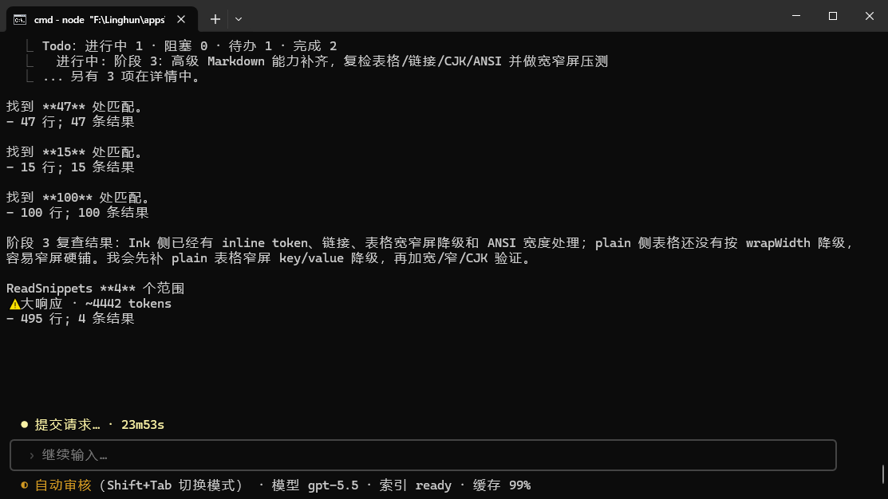

# Linghun

Linghun is a local-first, evidence-first AI coding terminal.

<p>
  <a href="https://www.npmjs.com/package/@linghun/cli"></a>
  <a href="./LICENSE"></a>
  
  
</p>

You can think of it as an engineering exoskeleton for large models. The model handles understanding, reasoning, and generation. Linghun connects the model to real projects, real tools, real permissions, real verification, and real context.

Ordinary chat tools can answer "how should I change this?" Linghun cares about another question: did it actually read the relevant code, edit the right files, run verification, and explain what remains uncertain?

That is the value of Linghun's anti-hallucination system. It is not merely about making the model "say fewer wrong things"; it turns reading facts, checking evidence, distinguishing verification scope, rejecting empty completion claims, and stating uncertainty into runtime constraints. The model still reasons and generates, but critical engineering conclusions should not rely on model confidence alone.

Full design: [Chinese Whitepaper](./WHITEPAPER.md) / [English Whitepaper](./WHITEPAPER.en.md) / [Updates](./docs/updates.en.md).

## Novita x Harbor Benchmark Records

Linghun has completed and submitted runs for the four public TB2.1 tracks in the Novita x Harbor Agent Benchmark:

| Track | Rank at submission | Harbor record |
| --- | --- | --- |
| File & Recovery | #2 | [f77879ac-b30f-47bb-8fb1-650108364fc0](https://hub.harborframework.com/jobs/f77879ac-b30f-47bb-8fb1-650108364fc0) |
| Systems & Security | #1 | [151a5351-bbf9-45c9-ae2f-1f8db1cd0619](https://hub.harborframework.com/jobs/151a5351-bbf9-45c9-ae2f-1f8db1cd0619) |
| Data & Science | #1 | [dc4a720b-79a5-49dd-b083-6fc40acd1079](https://hub.harborframework.com/jobs/dc4a720b-79a5-49dd-b083-6fc40acd1079) |
| Code & Debug | #3 | [23a26b7f-f1c0-4653-b0c2-4ecc4acae4de](https://hub.harborframework.com/jobs/23a26b7f-f1c0-4653-b0c2-4ecc4acae4de) |

## Special Thanks

<div>
  <table>
    <tr>
      <td>
        Thanks to <a href="https://www.geek2api.com/">geek2api</a> for supporting Linghun during development. geek2api provides one-stop access to mainstream AI services such as Claude, GPT, and Gemini without requiring users to manage multiple subscription accounts.<br /><br />
        Thanks also to the geek2api community members for their ideas and thoughtful support. Community group: <code>1104150634</code>.
      </td>
    </tr>
  </table>
</div>

## Updates

- **July 7, 2026 (Current Perfect Edition)**: A heavy update after deep real-world development: anti-hallucination now fits more tightly with the foundations, output is smoother, faster, and steadier, and cache hit rate has increased sharply to 96%+ without becoming dumb. Deep compact, the command surface, provider watchdogs, final-answer gates, and task progress display were hardened further. See: [Updates](./docs/updates.en.md#july-7-2026-heavy-update-after-deep-real-world-development).
- **July 5, 2026**: The terminal foundation, task panels, and runtime recovery path were hardened. Model output feels faster and smoother, and answers are displayed after anti-hallucination cleanup and evidence alignment, making cleaned responses steadier in more scenarios. See: [Updates](./docs/updates.en.md#july-5-2026-terminal-foundation-task-panels-and-runtime-recovery).
- **June 27, 2026**: Session storage, model streaming, and permission modes were tightened to reduce memory pressure in long conversations, make Claude / OpenAI-compatible streaming output more stable, and make command/file-edit behavior clearer in auto-review and full-access modes. See: [Updates](./docs/updates.en.md#june-27-2026-session-storage-model-streaming-and-permission-modes).
- **June 26, 2026**: The pre-check system expanded into multi-language deep layers, giving the model index facts, impact ranges, and language-level pre-check results earlier so it spends less time on blind file reading, repeated exploration, and rework. See: [Updates](./docs/updates.en.md#june-26-2026-pre-check-system-and-multi-language-deep-layers).
- **June 17, 2026**: The terminal display layer was tightened, and SourcePack / ReadSnippets deliver relevant code snippets faster. The user-facing effect is less waiting, fewer repeated Grep/Read calls, and faster movement into useful edits. See: [Updates](./docs/updates.en.md#june-17-2026-terminal-display-layer-and-tool-call-chain).

## What It Helps You Do

Linghun is built for real development, not demo-style Q&A. You can ask it in natural language to:

- read project structure and locate code problems;
- modify files, generate patches, and explain changes;
- run builds, tests, scripts, and verification commands;
- inspect Git state, create stable points, and help with rollback and handoff;
- use code indexing to reduce repeated file reading;
- constrain model drift with evidence, verification, and final-answer gates;
- reduce "conclusions without reading code" and "completion without verification" through anti-hallucination mechanisms;
- turn failure history, project rules, and historical context into signals that reduce rework in later turns;
- sense confusion, anxiety, damaged trust, urgency, or exploratory intent, and route the work more appropriately;
- distinguish focused verification, mock verification, real smoke, and unverified conclusions;
- control long logs, tool lists, and context noise to reduce wasted tokens;
- split long tasks into observable steps, background tasks, or multi-agent exploration;
- route different roles to different models, such as planning, execution, review, and summarization;
- remember confirmed project rules, failure lessons, and common working habits;
- work in real Windows, PowerShell, Chinese-path, and space-in-path environments;
- connect more external capabilities through MCP, Skills, Plugins, Hooks, and Capability Connectors.

In short: Linghun is not trying to answer whether models can write code. It is trying to make model participation in engineering more stable, controllable, and deliverable.

See the whitepaper: [2. User Pain Points and Practical Benefits](./WHITEPAPER.en.md#2-user-pain-points-and-practical-benefits), [3. Capability Overview](./WHITEPAPER.en.md#3-capability-overview).

## Product Screenshots

<p>
  
  
  
</p>

## Why It Is Not Just Another AI Chat Shell

Real AI coding often gets stuck here:

- the model answers confidently without reading code;
- a change runs, but damages project structure;
- one small command passes, but the model says the whole project passed;
- long logs and large files crowd out useful context;
- after one failure, the next attempt drifts into the same pit;
- multiple tools, models, and agents become harder to control;
- Windows processes, paths, and terminal compatibility break down;
- API keys, permissions, remote channels, and local execution boundaries are unclear.

Linghun handles these problems in the runtime, instead of only asking the model through prompts to "be careful."

It tries to record facts, constrain permissions, preserve evidence, distinguish verification scope, reduce context noise, keep long-task state visible, and state in final answers what was verified and what is only an inference.

"Foundation coupling" means these are not isolated features. File reads enter evidence; edits enter permission and path boundaries; verification affects final answers; Git state affects stable-point decisions; failure learning affects later routing; agent/job results can only serve as context, not as PASS. Once connected, the model no longer works alone in a chat box trying to be careful; it works inside an executable, verifiable, rollback-friendly, diagnosable engineering mainline.

See: [4. Evidence-first Engineering Loop](./WHITEPAPER.en.md#4-evidence-first-engineering-loop), [6. Output-side Anti-hallucination System](./WHITEPAPER.en.md#6-output-side-anti-hallucination-system), [15. Verification, Readiness, and Problems Panel](./WHITEPAPER.en.md#15-verification-readiness-and-problems-panel).

## It Is Not Prompt Engineering or Simple Loop Engineering

Linghun supports prompts, skills, and workflows, but it does not place reliability on "the model being self-disciplined."

A prompt can tell the model to verify before answering, but a prompt alone cannot guarantee that:

- file writes pass through permission and path checks;
- Bash commands are classified, constrained, and recorded;
- the model has real verification evidence before claiming completion;
- agent summaries, job completion, or remote events do not masquerade as PASS;
- Git, index, cache, memory, and remote approvals enter controlled paths;
- failures are reflected on and warn later similar tasks.

Linghun therefore moves key constraints into the system layer: tool execution, permissions, evidence, verification, Git, index, cache, process supervision, remote inbound, failure learning, and transcript all enter the same mainline.

This is the difference between Linghun and "stacking prompts / skills / loops": the model remains important, but facts, permissions, verification, and cost no longer depend only on what the model remembers in the moment.

See: [22. Runtime Capabilities vs. Skills](./WHITEPAPER.en.md#22-runtime-capabilities-vs-skills), [17. Central Orchestration](./WHITEPAPER.en.md#17-central-orchestration-from-prompt-injection-to-behavioral-routing).

## Visible Benefits

Linghun does not try to make the process more complex. It tries to remove hidden waste from real development:

- **Fewer hallucinations**: critical claims are tied as much as possible to file reads, tool results, verification records, and Git state.
- **Less model drift**: project rules, failure learning, architecture boundaries, and central orchestration affect later routes instead of starting from zero every turn.
- **Less rework**: local success is not presented as overall completion.
- **Lower context cost**: index, summaries, cache freshness, stable tool lists, and long-log budgets reduce repeated tokens.
- **Easier rollback and handoff**: Git stable points, handoff, agent transcripts, and verification boundaries make tasks easier to continue.
- **Better long-project continuity**: memory, failure reflection, project rules, and workspace snapshots keep multi-turn development from scattering.
- **More useful to individual and beginner developers**: common senior-engineer habits, such as reading facts first, keeping rollback points, checking verification scope, and reviewing historical pitfalls, become default behavior.
- **More suitable for teams and enterprises**: permission boundaries, private configuration, diagnosable logs, remote approvals, summary-only redaction, and local execution boundaries make AI easier to bring into real projects and internal workflows.

Whitepaper targets and observed ranges include:

- For continuous workflows with stable project, model, tool list, and system prompt, the target prompt-cache hit-rate range is **92%-96%**.
- Certain highly stable samples approach **98%**.
- In a small number of fully stable turns with short output and unchanged tools/schema, hit rate can reach the **100%** level.
- Central-orchestration and continuity benefits are architectural estimates, not fixed speedup promises. Real results depend on project, model, task, and usage data.

The whitepaper also gives scenario-based benefit estimates for foundation coupling:

| Scenario | Estimated improvement | Core reason |
| --- | --- | --- |
| Ordinary Q&A and simple coding | +5% ~ +15% | More consistent strategy: less likely to forget to read files, less likely to be interrupted by unnecessary gates. |
| Complex engineering tasks | +25% ~ +50% | Locate, understand, modify, and verify are constrained by routing and verification paths, not only by model suggestion. |
| Long-term project maintenance | +50% ~ +100% | The system can sense repeated failures, trust degradation, domain switches, and historical lessons, reducing cross-turn drift. |
| Multi-agent / multi-tool routing | +40% ~ +80% | Parallelism, downgrade, and compaction are decided from agent count, workflow state, resource pressure, and context pressure. |
| Risk judgment and safety boundary | +80% ~ +200% | Multiple gates move from model reference text to system-level enforcement, reducing empty PASS and unauthorized actions. |
| Personality continuity and self-narrative | Qualitative change | The system is not given emotions; it maintains strategy continuity in long sessions and does fewer wrong things at the wrong time. |

These numbers are not exact measurements or promises for every project. They express architectural benefit estimates: value comes not only from "better judgment," but from having those judgments executed by the system.

See: [2. User Pain Points and Practical Benefits](./WHITEPAPER.en.md#2-user-pain-points-and-practical-benefits), [11.5 Reference Cache Targets](./WHITEPAPER.en.md#115-reference-cache-targets), [17.8 Scenario-based Benefit Estimate](./WHITEPAPER.en.md#178-scenario-based-benefit-estimate-for-philosophy-module-closure-personality-continuity).

## Quick Start

Requirements:

- Node.js 22 or newer
- npm, pnpm, or another Node package manager

Install:

```bash
npm install -g @linghun/cli
```

Start Linghun in a project:

```bash
linghun
```

Windows also supports the uppercase compatibility entry:

```powershell
Linghun
```

Check the installed version:

```bash
linghun --version
```

## Model Setup

After starting Linghun, run:

```text
/model setup
```

The setup flow asks for:

- API base URL
- API key
- model name
- reasoning level

API keys are stored in a user-level private `provider.env`, not in the current project. Configuration priority is: shell environment variables first, then user private `provider.env`, then project/default settings.

Check provider configuration:

```text
/model doctor
```

See: [9. Provider Runtime](./WHITEPAPER.en.md#9-provider-runtime).

## A Real Workflow

You can say:

```text
Check why this project fails to build, fix the issue, run the relevant tests,
and create a stable point if everything passes.
```

Linghun aims to turn that into a controlled loop:

1. inspect project structure and relevant files;
2. form a short plan;
3. request confirmation before high-risk writes or commands;
4. edit files through the tool runtime;
5. run focused verification;
6. inspect Git state;
7. report what changed, what was verified, and what remains uncertain.

See: [5. Staged Engineering Workflow](./WHITEPAPER.en.md#5-staged-engineering-workflow), [13. Git Stable Points and Managed Worktree](./WHITEPAPER.en.md#13-git-stable-points-and-managed-worktree).

## Chinese and Windows Are First-class Citizens

Linghun treats Chinese developers and Windows development environments as core scenarios, not compatibility patches.

Chinese-first means:

- users can describe engineering tasks in Chinese, English, or mixed terminology;
- common diagnostics, configuration, model setup, cache, index, stable points, and troubleshooting paths are designed to understand Chinese workflows;
- beginners do not need to translate real intent into fixed English commands first;
- project rules, failure learning, memory, handoff, and long-task summaries can serve Chinese workflows.

Windows-first means:

- both `linghun` and `Linghun` entries are supported;
- PowerShell, cmd.exe, Windows Terminal, VS Code terminal, legacy conhost, and other terminal differences are treated seriously;
- Chinese paths, paths with spaces, multiple drives, real `projectPath`, and private configuration directories are treated seriously;
- long tasks, verification, runners, and jobs have process tracking and observable degradation;
- cancellation, timeout, exit, and interruption attempt bounded cleanup to reduce leftover processes.

This matters for individual developers and enterprise environments. Many AI coding tools feel smooth in demos, then become fractured in Windows, multi-drive, corporate permission, Chinese-path, and long-task environments. Linghun does not want those real environments to be second-class scenarios.

See: [20. Windows Compatibility Enhancements](./WHITEPAPER.en.md#20-windows-compatibility-enhancements), [19. Windows-grade Supervision and Native Runner](./WHITEPAPER.en.md#19-windows-grade-supervision-and-native-runner).

## Core Capabilities

The following are not vague future ideas. They are capability domains that have entered Linghun's foundation or mainline design. Some surfaces will continue to mature in product polish and cross-platform details, but the direction is not merely conceptual.

Whitepaper Section 3 maps to this README as follows:

| Whitepaper capability domain | README location |
| --- | --- |
| Engineering loop | Real workflow, Verification-aware delivery, Git stable points |
| Evidence and anti-hallucination | Evidence-first, fewer hallucinations |
| Long-task hosting | Workflow Matrix, long tasks, and multi-agent work |
| Multi-model routing | Multi-model routing |
| Tool system | Local tools and editing safety |
| Editing safety and code hygiene | Local tools and editing safety, Architecture system and AntiCodeBlob |
| Verification and readiness | Verification-aware delivery |
| Architecture system | Architecture system and AntiCodeBlob |
| Git workflow | Git stable points and Managed Worktree |
| Index and workspace awareness | Codebase index and workspace awareness |
| Cache and cost reduction | Cache and cost control |
| Project rules | Project rules and LINGHUN.md |
| Long-term context | Controlled memory, failure learning, and self-reflection |
| Central orchestration / Policy Kernel | Central orchestration, philosophy-module closure |
| Intent classification and understanding | Intent classification and understanding |
| User-state routing and personality continuity | User-state/emotion-aware routing, cross-turn personality continuity |
| Workflow Matrix / complex-task hosting | Workflow Matrix, long tasks, and multi-agent work |
| Multi-agent and long tasks | Workflow Matrix, long tasks, and multi-agent work |
| Permission system | Permissions, safety, and local privacy |
| Model runtime | Model runtime and provider diagnostics |
| Windows supervision and compatibility | Windows compatibility and commercial-grade supervision |
| Self-learning and reflection | Controlled memory, failure learning, and self-reflection |
| Extension ecosystem | Extension ecosystem and universal plug |
| External capability bridge / Capability Runtime | Extension ecosystem and universal plug |
| Remote connection | Remote channels |
| Output and interaction | TUI output and diagnostic layers |

### 1. Chinese-friendly and Low Learning Cost

Linghun does not ask users to memorize a large set of English commands first. You can describe real engineering intent in Chinese, English, or mixed terminology, such as "help me see why tests are failing," "create a stable point," "check cache hit rate," or "configure the model."

Complex capabilities live in slash commands, doctor, details, problems panel, command panel, and progressive disclosure. The default experience stays simple; advanced controls can be opened when needed.

See: [Product Philosophy](./WHITEPAPER.en.md#product-philosophy-strong-foundation-engineering-discipline-low-learning-cost).

### 2. Evidence-first, Fewer Hallucinations

Linghun tries to tie critical answers to actual observations: which files were read, which commands ran, what tools returned, what Git state is, and how large the verification scope really is.

It does not promise to never be wrong. It tries not to package unsupported inference as certain fact.

Anti-hallucination is not one system prompt. EvidenceSummary, completion checks, code-fact checks, architecture/boundary checks, Git operation checks, freshness rules for current external facts, and final-answer retry/downgrade work together to constrain answers.

See: [4. Evidence-first Engineering Loop](./WHITEPAPER.en.md#4-evidence-first-engineering-loop).

### 3. Architecture System and AntiCodeBlob

In real engineering, code that "runs" is not necessarily healthy. Linghun's architecture system looks at module boundaries, dependency direction, responsibility backflow, duplicate runtimes, permission bypass, diagnostic leakage, frontend/TUI experience constraints, and delivery consistency.

When users ask for a new system, feature, page, flow, long task, or cross-file change, the architecture system tries to organize the goal, project facts, recommended path, rejected path, staged breakdown, risks, verification items, and non-goals to avoid "write a pile first, clean up later."

AntiCodeBlob hints remind the model not to keep piling logic into god files, oversized functions, deep nesting, or boundaryless global state. It does not authorize broad refactoring; it exposes architecture risk earlier.

See: [7. Architecture System](./WHITEPAPER.en.md#7-architecture-system).

### 4. Local Tools and Editing Safety

Linghun includes Read, Write, Edit, MultiEdit, Grep, Glob, Bash, Todo, Diff, and Git tool paths. File writes and command execution pass through permission, path, safety, and result-summary boundaries.

It also cares about code hygiene: explanations belong in replies, reports, or handoff, not in source code as "temporary code," "what I did," or similar noise.

See: [10. Tool Execution and Editing Safety](./WHITEPAPER.en.md#10-tool-execution-and-editing-safety), [10.1 Code Hygiene](./WHITEPAPER.en.md#101-code-hygiene-keep-explanations-in-delivery-text-not-source-code).

### 5. Permissions, Safety, and Local Privacy

Linghun executes code on your machine by default. Model provider keys are stored outside the project by default. Remote channels, external capabilities, file writes, Bash, Git, and index refresh all return to local permission boundaries.

See: [12. Permissions, Safety, and Resource Boundaries](./WHITEPAPER.en.md#12-permissions-safety-and-resource-boundaries), [12.1 Developer Sovereignty, Safety, and Privacy](./WHITEPAPER.en.md#121-developer-sovereignty-safety-and-privacy).

### 6. Verification-aware Delivery

Linghun does not treat "a command ran" as "the project is complete." It distinguishes PASS, PARTIAL, FAIL, TIMEOUT, STALE, CANCELLED, focused verification, mock verification, real smoke, and unverified conclusions.

This reduces rework caused by "it looked done, but the loop was not closed."

See: [15. Verification, Readiness, and Problems Panel](./WHITEPAPER.en.md#15-verification-readiness-and-problems-panel).

### 7. Codebase Index and Workspace Awareness

Linghun can use code indexing, search, architecture evidence, workspace snapshots, and large-file safety to reduce repeated file reading. It does not ask the model to guess project structure from scratch every turn.

The CLI package ships with bundled `codebase-memory-mcp` binaries for common desktop platforms:

- Windows x64
- Linux x64
- macOS Apple Silicon
- macOS Intel

See: [14. Index, Cache, and Workspace Snapshot](./WHITEPAPER.en.md#14-index-cache-and-workspace-snapshot).

### 8. Cache and Cost Control

Linghun cares about prompt cache, stable tool lists, context noise, long-log summaries, cache freshness, and usage tracking. The goal is to reduce repeated tokens and concentrate strong-model calls where they matter.

See: [11. Stable Tool Calls and Cost Reduction](./WHITEPAPER.en.md#11-stable-tool-calls-and-cost-reduction), [25. Cost and Performance Control](./WHITEPAPER.en.md#25-cost-and-performance-control).

### 9. Git Stable Points and Managed Worktree

Before and after large changes, Linghun can inspect Git state, create stable points, help manage worktrees, and tie Git-related claims to actual repository state.

This makes "try a version," "roll back," and "handoff to the next turn" more controllable.

See: [13. Git Stable Points and Managed Worktree](./WHITEPAPER.en.md#13-git-stable-points-and-managed-worktree).

### 10. Workflow Matrix, Long Tasks, and Multi-agent Work

Complex tasks should not be forced through one chat stream. Linghun supports Workflow Matrix, durable jobs, background tasks, agent transcripts, budgets, step limits, logs, reports, and handoff boundaries.

Workflow Matrix breaks complex goals into phases, slices, roles, risk hints, runtime proposals, and evidence requirements. The execution layer reuses `/job`, `/fork`, `/agents`, verification, details, architecture checks, Git stable-point suggestions, memory summaries, failure-risk hints, and remote summaries.

Evidence Merge distinguishes "evidence that can support a completion claim" from "state that can only serve as context." Agent summaries, job completion, remote events, and failure learning cannot directly masquerade as PASS.

Users should see task state and key progress, not raw logs and low-level tool noise.

See: [18. Workflow Matrix and Long-task Hosting](./WHITEPAPER.en.md#18-workflow-matrix-and-long-task-hosting).

### 11. Model Runtime and Provider Diagnostics

Linghun supports OpenAI-compatible, DeepSeek, and Anthropic Messages-style endpoints, including streaming output, tool calls, usage, reasoning, timeout, idle timeout, provider diagnostics, and failure summaries.

The normal main screen does not leak provider, baseUrl, endpointProfile, or plaintext keys. When users need diagnostics, `/model doctor`, route doctor, and redacted source diagnostics show configuration state.

See: [9. Provider Runtime](./WHITEPAPER.en.md#9-provider-runtime).

### 12. Multi-model Routing

Planning, execution, review, verification, summarization, vision, and image roles can use different model routes. Linghun is not tied to one model vendor; it provides an engineering exoskeleton for different large models.

See: [8. Role-based Multi-model Routing](./WHITEPAPER.en.md#8-role-based-multi-model-routing), [27. Engineering Exoskeleton for All Large Models](./WHITEPAPER.en.md#27-engineering-exoskeleton-for-all-large-models).

### 13. Project Rules and LINGHUN.md

Many projects start without engineering rules, so the model has to guess every turn: which verification command to run, which directories can be changed, what code style is expected, and what must not be touched.

Linghun detects `LINGHUN.md` on startup. If missing, it only gives a light hint and does not write automatically. Users explicitly run `/memory init` to create a base template. Rule summaries enter `/memory`, `/resume`, readiness, and CacheFreshness, but the full file is not dumped onto the main screen.

This establishes AI development order from an empty repository: fact-first, permission, verification, code hygiene, and minimal-change boundaries have a reusable entry point.

See: [16.1 Project Rules](./WHITEPAPER.en.md#161-project-rules-establishing-ai-development-order-from-an-empty-repository).

### 14. Controlled Memory, Failure Learning, and Self-reflection

Linghun can retain project rules, handoff summaries, controlled memory, and failure lessons. It does not try to secretly remember everything; it turns confirmed experience into signals that reduce drift, repeated explanation, and repeated mistakes in later turns.

Controlled memory follows a candidate-first confirmation flow, avoiding writing one-off emotions, sensitive information, or unconfirmed facts into long-term rules. Failure learning records real failures, reflects on lessons, and provides resolve/ignore lifecycle paths so later similar tasks become more cautious.

See: [16. Long-term Context, Controlled Memory, Self-learning, and Reflection](./WHITEPAPER.en.md#16-long-term-context-controlled-memory-self-learning-and-reflection), [16.3 Self-learning](./WHITEPAPER.en.md#163-self-learning), [16.4 Reflection and Failure Learning](./WHITEPAPER.en.md#164-reflection-and-failure-learning).

### 15. Central Orchestration

Linghun combines task type, permissions, evidence, memory, failure records, provider state, workflow state, user state, context pressure, architecture boundaries, terminal capability, and verification needs to decide whether the current turn should read code first, clarify first, verify first, remain ordinary chat, or enter a more complex task flow.

It does not solve this by "adding a longer prompt." It condenses memory, failure learning, evidence, permissions, architecture, provider, context, workflow/agent state, and platform state into structured policy, then lets mainline subsystems execute those policies.

See: [17. Central Orchestration](./WHITEPAPER.en.md#17-central-orchestration-from-prompt-injection-to-behavioral-routing).

### 16. Intent Classification and Understanding

Linghun does not want to hard-route based only on keywords. Intent classification combines continuity signals, failure/success, task-domain switching, trust score, weighted keyword scoring, and model clarification when needed, producing primary and secondary intents.

This lets the system prepare both "read files first" and "may need write approval" in the same turn, instead of misclassifying natural language as a rigid command. Not guessing too hard is part of reducing route drift.

See: [17.9 Intent Classifier Upgrade](./WHITEPAPER.en.md#179-intent-classifier-upgrade-from-regex-matching-to-signal-aware-understanding).

### 17. User-state and Emotion-aware Routing

Linghun does not treat user state as merely "make the tone warmer." When the user is confused, anxious, repairing trust, exploring strategy, giving a decisive command, approaching a high-risk release, urgent, or fatigued, that state becomes a routing signal.

For example:

- when the user is clearly confused, the system tends to explain first, lower terminology density, and give an executable next step;
- when the user is anxious or trust is damaged, the system tends to prioritize source facts, verification, and explicit evidence boundaries;
- when the user is exploring strategy, the system tends to compare options and avoid eagerly starting file writes, agents, jobs, or workflows;
- in high-risk contexts such as release, stable points, or open-source preparation, the system raises verification and final-answer gate requirements.

This is not a comfort template or emotional chat. It turns "what the user really needs now" into engineering routing: less random motion, less long noise, and more fact-checking, risk confirmation, and verification-scope clarity at the right moment.

The boundary is also clear: emotions and user state cannot replace permission approval, cannot count as test evidence, cannot make agent/job/workflow execute automatically, and cannot justify unauthorized writes because "the user is in a hurry."

See: [17.3 User State Routing](./WHITEPAPER.en.md#173-user-state-routing).

### 18. Philosophy-module Closure

Linghun's "philosophy module" is not a value statement written into prompts. It connects key engineering principles into the mainline.

If orchestration decides "this turn should verify," but the verification runner does not read that decision; if it decides "this turn needs a permission gate," but the permission engine does not know; if it decides "context should be compacted first," but compaction still triggers independently, then the philosophy is still just a strategy note.

Philosophy-module closure upgrades final-answer gate, verification preference, retry guard, pre-compaction, blocked-runtime termination, and failure-learning capture from "text for the model to consider" into system-level constraints checked before model calls, tool execution, verification, context compaction, and agent startup.

The user does not experience this as more panels. They experience fewer wrong actions at wrong moments: fewer hard retries after failure, fewer write confirmations during exploration, fewer late compactions after context is already full, and fewer local completions packaged as overall success.

See: [17.6 From Strategy Text to System Enforcement](./WHITEPAPER.en.md#176-from-strategy-text-to-system-enforcement-philosophy-module-closure).

### 19. Cross-turn Personality Continuity

A long-term project is not 50 unrelated Q&A turns. Linghun needs to know whether this is turn 3 or turn 30, a first attempt or a third failure, the same task or a new domain.

Cross-turn personality continuity does not give the system emotions. It gives the system cross-turn memory:

- after repeated failures, it becomes more cautious and increases source-first and verification strength;
- after repeated success with verification, it gradually returns to normal rhythm and reduces unnecessary gates;
- when the task domain switches, it lowers the weight of the previous domain's failure lessons to avoid polluting the new task;
- when trust score is low, it becomes more conservative and rejects empty PASS;
- in long sessions, it increases compaction tendency to avoid context bloat.

It simulates how an experienced engineer collaborates: after repeated failure, you do not charge forward as if this were the first try; you reread facts, confirm understanding, then modify and verify more carefully.

See: [17.7 Cross-turn Personality Continuity](./WHITEPAPER.en.md#177-cross-turn-personality-continuity-letting-the-system-remember-where-we-are).

### 20. TUI Output and Diagnostic Layers

The main screen should let users understand what is happening. Full logs, tool details, failure details, problems panel, and diagnostics belong behind expandable surfaces so the visible layer does not become machine logs.

See: [24. TUI Output and Interaction Layers](./WHITEPAPER.en.md#24-tui-output-and-interaction-layers).

### 21. Windows Compatibility and Commercial-grade Supervision

Linghun treats Windows as a first-class runtime environment instead of assuming Unix-like tooling. It cares about:

- `linghun` / `Linghun` dual entries;
- PowerShell, cmd.exe, Windows Terminal, VS Code terminal, and other terminal differences;
- Chinese paths, paths with spaces, real `projectPath`;
- legacy terminal fallback rendering;
- process tracking for long tasks, verification, runners, and jobs;
- bounded cleanup on cancellation, timeout, exit, and interruption;
- observable degradation between Native Runner / Process Guard and Node fallback.

In short, Linghun does not want Windows users to keep losing time to paths, terminals, and leftover processes during AI coding.

See: [19. Windows-grade Supervision and Native Runner](./WHITEPAPER.en.md#19-windows-grade-supervision-and-native-runner), [20. Windows Compatibility Enhancements](./WHITEPAPER.en.md#20-windows-compatibility-enhancements).

### 22. Extension Ecosystem and Universal Plug

Linghun's long-term direction is not only "a terminal that writes code." It is to let models connect to more real capabilities through unified boundaries.

MCP, Skills, Plugins, Workflows, and Hooks provide extension entry points, but follow the principle: metadata before execution, trust before enablement, diagnostics before use.

Capability Runtime / App Bridge abstracts external software capabilities into transport, auth, permission, riskLevel, inputSchema, outputSchema, and provider. External applications can expose capabilities through manifests and connectors; Linghun then handles natural-language matching, permission confirmation, execution, evidence recording, and result noise control.

This is the "universal plug" shape from the whitepaper: the model does not need every software product hardcoded into itself, and every app does not need to rebuild its own agent. Capabilities enter the same permission, evidence, verification, and failure-degradation mainline.

For developers, the connection path should be thin:

1. write a local manifest declaring appId, name, version, transport, baseUrl, auth, and capabilities;
2. implement `GET /linghun/capabilities` and `POST /linghun/execute` in the local app;
3. run `/apps validate <manifestPath>` for read-only validation;
4. run `/apps connect <manifestPath>` to explicitly connect;
5. later trigger the capability through `/capabilities run <capabilityId> <json>` or natural language.

The current real connection path is Local HTTP Connector: `transport` must be `http`, and `baseUrl` must be loopback `localhost` / `127.0.0.1` / `[::1]`. Linghun does not scan in the background, does not auto-connect unknown software, does not allow raw secrets in manifests, does not allow external apps to directly write transcript or evidence, and does not treat connector execution results as verification PASS.

Connection materials:

- [Capability Runtime / App Bridge Developer Guide](./docs/developers/capability-runtime-app-bridge.en.md)
- [Capability Runtime / App Bridge Chinese Guide](./docs/developers/capability-runtime-app-bridge.md)
- [App Bridge Manifest JSON Schema](./APP_BRIDGE_MANIFEST.schema.json)
- [Node example connector](./app-bridge-examples/node-demo)
- [Python example connector](./app-bridge-examples/python-demo)

See: [21. Extension Ecosystem](./WHITEPAPER.en.md#21-extension-ecosystem-mcp-skills-plugins-hooks), [22. Runtime Capabilities vs. Skills](./WHITEPAPER.en.md#22-runtime-capabilities-vs-skills), [30. Long-Term Preview Toward a Personal AI Butler](./WHITEPAPER.en.md#30-long-term-preview-toward-a-personal-ai-butler).

### 23. Remote Channels

Real long tasks do not always require users to sit in front of the computer. Linghun's remote-channel direction is to send important local-session events to the IM channels users already use, and after official app, event callback, Stream, or local bridge daemon setup, return approvals or natural-language input back into the local Linghun mainline.

The boundary is explicit: remote channels are not remote execution platforms that bypass local permissions, and they should not freely send complete code or complete transcripts to external platforms.

Target channels include:

- WeCom
- Feishu / Lark
- DingTalk
- webhook / bridge transport

See: [23. Remote Channel Boundary](./WHITEPAPER.en.md#23-remote-channel-boundary).

## Open-source Value

Linghun's open-source value is not "one more model API integration." It is a reusable runtime that brings scattered engineering capabilities together:

- provider runtime
- permission policy
- evidence and final-answer gate
- prompt cache and cost control
- Git stable point / managed worktree
- controlled memory and failure learning
- durable job / multi-agent lifecycle
- Windows process guard and Native Runner boundary
- command panel, details, readiness, problems, verification surfaces
- MCP, Skills, Plugins, Hooks, Capability Runtime / App Bridge

These capabilities work together to move AI coding from "can answer" toward "can participate in real engineering delivery."

See: [26. Self-developed Runtime and Open-source Value](./WHITEPAPER.en.md#26-self-developed-runtime-and-open-source-value).

## Value for Developers and Enterprises

For individual developers:

- use natural language to advance real projects instead of first learning a full tool grammar;
- repeat less project background and search fewer files again and again;
- keep stable points before large changes and roll back more easily after failures;
- see verification scope more clearly and avoid being misled by answers that only look complete;
- get a better Windows, Chinese-path, PowerShell, and multi-drive experience;
- push ideas into runnable, verifiable, iterable projects at lower cost.

For professional developers:

- move AI from "chat advice" into reading repositories, changing code, running verification, preserving evidence, and handing off work;
- bring architecture boundaries, verification boundaries, Git state, and failure reflection into the workflow;
- reduce manual routing, repeated confirmation, and cross-session organization cost;
- use multi-model routing, agents, jobs, and workflows for more complex engineering tasks.

For teams and enterprises:

- API keys, data directories, memory, logs, jobs, cache, and index metadata can be managed at project, user, or custom-directory scope;
- safety, privacy, permissions, paths, remote approval, and summary-only redaction have explicit boundaries;
- code execution, Bash, Git, index refresh, remote input, and external capabilities all return to the local permission pipeline, so external entry points do not become uncontrolled executors;
- provider keys live outside projects by default, and doctor only shows redacted sources, avoiding plaintext keys, baseUrl, or internal endpoints on the main screen or transcript;
- evidence, verification, transcript, problems, doctor, and log artifacts make AI work easier to audit, review, and troubleshoot;
- staged mainline, Workflow Matrix, Git stable points, verification boundaries, and handoff make AI work feel more like an engineering process than a one-off chat result;
- remote notifications and approvals can connect to WeCom, Feishu/Lark, and DingTalk;
- capability manifests and connectors let internal systems gradually expose AI capabilities without each app rebuilding a full agent;
- external apps only need to expose clear capabilities; Linghun handles natural-language matching, permission confirmation, secret redaction, evidence recording, result budget, and failure boundaries.

See: [27. Engineering Exoskeleton for All Large Models](./WHITEPAPER.en.md#27-engineering-exoskeleton-for-all-large-models), [12.1 Developer Sovereignty, Safety, and Privacy](./WHITEPAPER.en.md#121-developer-sovereignty-safety-and-privacy), [23. Remote Channel Boundary](./WHITEPAPER.en.md#23-remote-channel-boundary).

## Long-term Vision: From AI Coding Terminal to Jarvis-like Runtime

Linghun currently serves developer engineering scenarios first, but its foundation is not limited to code editing.

In the long run, it can be understood as an early engineering foundation for a Jarvis-like personal AI runtime: the model handles understanding, reasoning, dialogue, planning, and personality expression; the runtime connects software, hardware, memory, permissions, evidence, verification, remote channels, long tasks, and capability ecosystems.

This vision is not about waiting for a single omniscient model. No matter how strong a model becomes, it still needs fresh facts, network information, software APIs, hardware devices, sensor state, user memory, permission boundaries, and action channels. A powerful brain without senses, nerves, body, and actuators remains at the dialogue layer.

Linghun already has this foundation shape in developer scenarios:

- **model brain**: provider runtime and multi-model role routing;
- **tool body**: Read, Write, Edit, Bash, Git, index, verification enter the same execution chain;
- **universal plug prototype**: Capability Runtime / App Bridge abstracts external capabilities into manifests and connectors;
- **permission nervous system**: permission modes, path safety, command classification, workspace trust, and resource caps;
- **evidence and completion boundary**: tool results, Git, verification, index, and provider failure can enter evidence;
- **memory and continuity foundation**: session, handoff, controlled memory, failure learning, and user-state routing;
- **multi-agent and long tasks**: agents, jobs, workflows, managed worktrees, and bounded worker loop;
- **remote entry**: notification, approval, natural-language inbound, and mobile status viewing;
- **cost and context control**: prompt cache, CacheFreshness, summary-first, deferred tools, and bounded logs.

If Read, Edit, Verification, Evidence, Permission, Memory, Agent, and Remote in the code world are replaced by calendars, email, documents, tickets, smart homes, device state, sensors, and enterprise systems, this foundation can naturally migrate into a personal AI butler or enterprise workflow assistant.

That is the long-term meaning of the universal plug: intelligent systems should not hardcode every software product or device. Capabilities should enter the same trusted mainline through unified schema, permissions, evidence, and failure degradation.

See: [30. Long-Term Preview Toward a Personal AI Butler](./WHITEPAPER.en.md#30-long-term-preview-toward-a-personal-ai-butler).

## Current Boundaries

Linghun is under active development. CLI/TUI runtime, local tool execution, provider configuration, evidence-first engineering flow, bundled codebase index runtime, and many engineering-control surfaces are already implemented. Some advanced capabilities, especially multi-platform native-runner packaging, remote-channel product polish, external capability ecosystem, and public documentation, will continue to mature.

Use Linghun as a local engineering assistant with evidence and permission boundaries, not as an autonomous system that should be trusted blindly.

See: [31. Explicit Boundaries](./WHITEPAPER.en.md#31-explicit-boundaries).

## Documentation

- [Chinese Whitepaper](./WHITEPAPER.md)
- [English Whitepaper](./WHITEPAPER.en.md)
- [Apache-2.0 License](./LICENSE)

Recommended sections:

- [1. Product Positioning](./WHITEPAPER.en.md#1-product-positioning)
- [2. User Pain Points and Practical Benefits](./WHITEPAPER.en.md#2-user-pain-points-and-practical-benefits)
- [3. Capability Overview](./WHITEPAPER.en.md#3-capability-overview)
- [4. Evidence-first Engineering Loop](./WHITEPAPER.en.md#4-evidence-first-engineering-loop)
- [12. Permissions, Safety, and Resource Boundaries](./WHITEPAPER.en.md#12-permissions-safety-and-resource-boundaries)
- [14. Index, Cache, and Workspace Snapshot](./WHITEPAPER.en.md#14-index-cache-and-workspace-snapshot)
- [18. Workflow Matrix and Long-task Hosting](./WHITEPAPER.en.md#18-workflow-matrix-and-long-task-hosting)
- [19. Windows-grade Supervision and Native Runner](./WHITEPAPER.en.md#19-windows-grade-supervision-and-native-runner)
- [21. Extension Ecosystem](./WHITEPAPER.en.md#21-extension-ecosystem-mcp-skills-plugins-hooks)
- [26. Self-developed Runtime and Open-source Value](./WHITEPAPER.en.md#26-self-developed-runtime-and-open-source-value)
- [30. Long-Term Preview Toward a Personal AI Butler](./WHITEPAPER.en.md#30-long-term-preview-toward-a-personal-ai-butler)
- [31. Explicit Boundaries](./WHITEPAPER.en.md#31-explicit-boundaries)

## Author's Note

Linghun comes from my own long-term, high-intensity use of AI coding tools, and from the problems I encountered through real projects, development, rework, verification, and reflection. From the beginning, I have not wanted it to be built on attacking or belittling any product or model provider. On the contrary, Linghun respects the huge cost that model providers have invested in training, inference, tool use, and long-context capability, and it genuinely benefits from the rapid progress of these capabilities.

My judgment is this: today's AI is not unable to work; it is not yet always able to work in an engineered, constrained, verifiable, and deliverable way. As models continue to advance quickly, "super individuals" will not be just a slogan. The real key is connecting model capability to engineering boundaries such as evidence, permissions, tools, verification, memory, cost, long tasks, and external capabilities. When models can work in an engineered way, the productivity they bring can be extraordinary.

I also believe that a widely accessible Jarvis-like AI runtime will land sooner than many people expect, and in a more accessible form. Of course, this is only my personal projection and inference. In an era where model capability is advancing rapidly, creativity, judgment, and execution will become increasingly valuable.

If you have more ideas, or if you run into problems while using Linghun, feel free to contact me. I will try to solve them one by one. Thank you again to the model providers for the real gains they have enabled, and thank you to every developer who provides good ideas, good work, and real feedback.

I also hope you can use Linghun to build better work and improve your own efficiency, instead of being led along by model answers that look clever but have no evidence. I believe many developers know this feeling well.

## Next Steps

- Continue polishing the terminal TUI experience so main-screen output, task state, scrolling, interaction feedback, and diagnostic layers feel more natural, stable, and suitable for long-term engineering work.
- Move toward remote entry and multi-device collaboration while keeping Linghun local-first, evidence-first, and permission-bounded, so it can support richer multi-task, notification, approval, and long-project collaboration workflows.

## Contact and Support

If you are interested in Linghun, want to share feedback, connect external app capabilities, or support continued product polish, you can contact or support the project below.

<p>
  
  
</p>

## License

Linghun is licensed under the [Apache License 2.0](./LICENSE).

For commercial licensing, enterprise support, private deployment, custom integration, or brand partnership, please contact the author.
