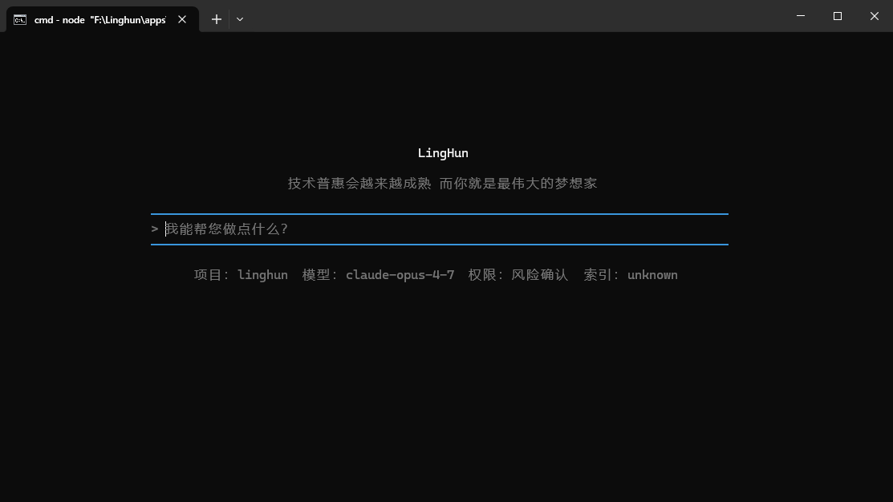
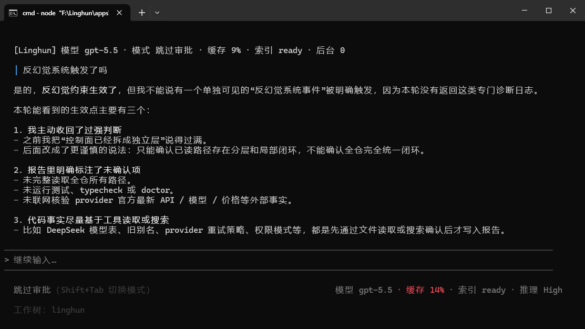
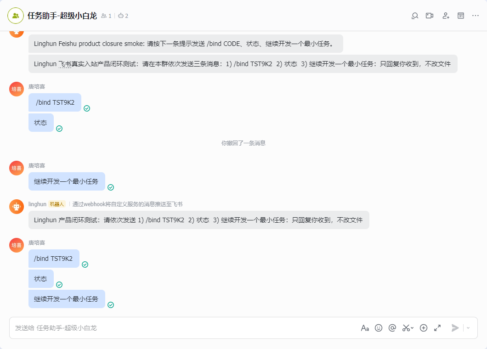

<div align="center">

# Linghun

**本地优先、证据优先的 AI 编程终端**

把大模型接到真实项目、真实工具、真实权限、真实验证和真实上下文里。

<p>
  <a href="https://www.npmjs.com/package/@linghun/cli"></a>
  <a href="./LICENSE"></a>
  
  
</p>

[English README](./README.en.md) · [中文白皮书](./WHITEPAPER.md) · [English Whitepaper](./WHITEPAPER.en.md) · [更新记录](./docs/updates.md) · [English Updates](./docs/updates.en.md) · [App Bridge](./docs/developers/capability-runtime-app-bridge.md)

</div>

```bash
npm install -g @linghun/cli
linghun
```

---

Linghun 可以理解成：给大模型装上一套工程化外骨骼。模型负责理解、推理和生成；Linghun 负责把模型接到真实项目、真实工具、真实权限、真实验证和真实上下文里。

普通聊天工具可以回答“应该怎么改”。Linghun 更关心另一件事：它有没有真的读过相关代码、有没有真的改对文件、有没有真的跑过验证、有没有把不确定的地方说清楚。

这就是 Linghun 反幻觉系统的价值：不是让模型少说错话那么简单，而是把“读事实、看证据、区分验证范围、拒绝空口完成、说明不确定性”变成运行时约束。模型仍然会推理和生成，但关键工程结论不能只靠模型自信。

## Novita x Harbor 榜单记录

Linghun 已完成 Novita x Harbor Agent Benchmark 四个公开 TB2.1 榜单的运行与提交：

| 榜单 | 提交时名次 | Harbor 记录 |
| --- | --- | --- |
| File & Recovery | 第 2 名 | [f77879ac-b30f-47bb-8fb1-650108364fc0](https://hub.harborframework.com/jobs/f77879ac-b30f-47bb-8fb1-650108364fc0) |
| Systems & Security | 第 1 名 | [151a5351-bbf9-45c9-ae2f-1f8db1cd0619](https://hub.harborframework.com/jobs/151a5351-bbf9-45c9-ae2f-1f8db1cd0619) |
| Data & Science | 第 1 名 | [dc4a720b-79a5-49dd-b083-6fc40acd1079](https://hub.harborframework.com/jobs/dc4a720b-79a5-49dd-b083-6fc40acd1079) |
| Code & Debug | 第 3 名 | [23a26b7f-f1c0-4653-b0c2-4ecc4acae4de](https://hub.harborframework.com/jobs/23a26b7f-f1c0-4653-b0c2-4ecc4acae4de) |

## 特别感谢

<div>
  <table>
    <tr>
      <td>
        感谢 <a href="https://www.geek2api.com/">geek2api 中转站</a> 对 Linghun 开发过程中的支持。geek2api 提供一站式 AI 服务接入能力，无需管理多个订阅账号，即可接入 Claude、GPT、Gemini 等主流 AI 服务。<br /><br />
        也感谢 geek2api 中转站各位群友提供的相关思路和思想支持。交流群号：<code>1104150634</code>。
      </td>
    </tr>
  </table>
</div>

## 更新记录

- **2026-07-05**：终端底座、任务面板和运行时恢复继续加固，模型输出更快更丝滑；模型回答在反幻觉清洗、证据对齐后再展示，部分场景下清洗后的回答展示更稳定。详见：[更新记录](./docs/updates.md#2026-07-05-终端底座任务面板与运行时恢复)。
- **2026-06-27**：会话存储、模型流式输出和权限模式继续收敛，降低长对话内存压力，让 Claude / OpenAI 兼容流式输出更稳定，并让自动审核、完全放行等模式的命令与改文件体验更清晰。详见：[更新记录](./docs/updates.md#2026-06-27-会话存储模型流式输出与权限模式)。
- **2026-06-26**：预检系统扩展为多语言深度层，让模型开工前更快拿到索引、影响范围和语言级预检结果，减少无效读文件、重复探索和返工。详见：[更新记录](./docs/updates.md#2026-06-26-预检系统与多语言深度层)。
- **2026-06-17**：终端可见层继续收敛，SourcePack / ReadSnippets 把相关代码片段更快交给模型，用户体感是更少等待、更少重复 Grep/Read、更快进入有效修改。详见：[更新记录](./docs/updates.md#2026-06-17-终端可见层与工具调用链)。

## 它能帮你做什么

Linghun 面向真实开发，而不是只做演示式问答。你可以直接用自然语言让它：

- 阅读项目结构，定位代码问题；
- 修改文件、生成补丁、解释改动；
- 运行构建、测试、脚本和验证命令；
- 检查 Git 状态，创建稳定点，辅助回滚和交接；
- 用代码索引减少重复读文件；
- 用证据、验证和最终回答闸门约束模型漂移；
- 用反幻觉系统减少“没读代码就下结论”“没验证就说完成”；
- 把失败经验、项目规则和历史上下文变成下一轮少返工的辅助信号；
- 感知用户困惑、焦虑、信任受损、急迫或探索状态，并转成更合适的工程路线；
- 区分局部验证、mock 验证、真实 smoke 和未验证结论；
- 控制长日志、工具列表和上下文噪音，减少无效 token 消耗；
- 把长任务拆成可观察的步骤、后台任务或多智能体探索；
- 根据不同角色切换不同模型，例如规划、执行、审查、总结；
- 记住经过确认的项目规则、失败经验和常用工作方式；
- 在 Windows、PowerShell、中文路径、带空格路径等真实环境里工作；
- 通过 MCP、Skills、Plugins、Hooks、Capability Connectors 接入更多外部能力。

一句话：Linghun 想解决的不是“模型会不会写代码”，而是“模型参与工程时，怎么更稳、更可控、更能交付”。

详见白皮书：[2. 用户痛点与实际收益](./WHITEPAPER.md#2-用户痛点与实际收益)、[3. 能力总览](./WHITEPAPER.md#3-能力总览)。

## 产品截图

<p>
  
  
  
</p>

## 为什么不是普通 AI 聊天壳

真实 AI 编程经常卡在这些地方：

- 模型没读代码就自信回答；
- 改动能运行，但破坏了项目结构；
- 测了一个小命令，却说整个项目都通过；
- 长日志和大文件把上下文挤爆；
- 一轮失败后，下次还在同一个地方漂移；
- 多工具、多模型、多智能体越接越乱；
- Windows 进程、路径、终端兼容性出问题；
- API key、权限、远程通道和本地执行边界不清楚。

Linghun 的思路是把这些问题放到运行时里处理，而不是只靠提示词提醒模型“小心一点”。

它会尽量记录事实、约束权限、保留证据、区分验证范围、控制上下文噪音、给长任务可见状态，并在最终回答里说明哪些已经验证，哪些只是推断。

底座咬合能力代表的是：这些能力不是孤立功能点。读文件会进入 evidence，编辑会进入权限和路径边界，验证会影响最终回答，Git 状态会影响稳定点判断，失败学习会影响下一轮调度，agent/job 的结果只能作为上下文，不能直接冒充 PASS。它们连在一起后，模型不再是单独在聊天框里“尽量小心”，而是在一条可执行、可验证、可回滚、可诊断的工程主链里工作。

详见白皮书：[4. Evidence-first 工程闭环](./WHITEPAPER.md#4-evidence-first-工程闭环)、[6. 输出侧反幻觉系统](./WHITEPAPER.md#6-输出侧反幻觉系统)、[15. 验证、就绪与问题面板](./WHITEPAPER.md#15-验证就绪与问题面板)。

## 它不是提示词工程，也不是简单 loop 工程

Linghun 支持 prompt、skills 和工作流，但它不把可靠性寄托在“让模型自觉一点”上。

提示词可以告诉模型“请先验证再回答”，但提示词本身不能保证这些事真的发生：

- 写文件前经过权限和路径判断；
- Bash 命令被分类、限制和记录；
- 模型声称“已完成”前有真实验证证据；
- agent summary、job completed 或 remote event 不被冒充成 PASS；
- Git、索引、缓存、记忆、远程审批进入受控路径；
- 失败被复盘，并在下次相似任务中提醒。

所以 Linghun 把关键约束沉到系统层：工具执行、权限、证据、验证、Git、索引、缓存、进程守护、远程入站、失败学习和 transcript 都进入同一条主链。

这也是它和“堆 prompts / 堆 skills / 堆循环”的区别：模型仍然很重要，但事实、权限、验证和成本不再只靠模型临场记住。

详见白皮书：[22. 底层能力与 Skill 的边界](./WHITEPAPER.md#22-底层能力与-skill-的边界)、[17. 中枢调度系统](./WHITEPAPER.md#17-中枢调度系统从提示词回灌到行为调度)。

## 能看到的收益

Linghun 追求的收益不是让流程更复杂，而是把真实开发里的隐性浪费拿掉：

- **更少幻觉**：关键结论尽量绑定文件读取、工具结果、验证记录和 Git 状态。
- **更少模型漂移**：项目规则、失败学习、架构边界和中枢调度会影响后续路线，而不是每轮从零开始猜。
- **更少返工**：不把局部成功包装成整体完成，减少“以为好了，后来又要重做”的情况。
- **更低上下文成本**：索引、摘要、缓存新鲜度、稳定工具列表和长日志控噪减少重复 token。
- **更容易回滚和交接**：Git 稳定点、handoff、agent transcript 和验证边界让任务可以继续推进。
- **更适合长期项目**：记忆、失败复盘、项目规则和工作区快照让多轮开发不容易散掉。
- **更适合个人开发者和新手**：把资深开发者常做的“先读事实、先留回滚点、先验证范围、先看历史坑”做成默认工作方式。
- **更适合团队和企业**：权限边界、私有配置、可诊断日志、远程审批、summary-only redaction 和本地执行边界，让 AI 更容易进入真实项目和内部流程。

白皮书中的目标和观测口径包括：

- 稳定项目、稳定模型、稳定工具列表、稳定 system prompt 的连续工作流，目标缓存命中率区间为 **92%-96%**。
- 特定高稳定样本接近 **98%**。
- 上下文完全稳定、输出短、工具/schema 不变化的少数回合可达到 **100%** 级别命中。
- 中枢调度与连续性收益是架构层面的估计，不是固定提速承诺；实际收益取决于项目、模型、任务和 usage 数据。

白皮书也给出了一组场景化收益估计，用来说明“底座咬合”带来的差异：

| 场景 | 提升幅度 | 核心原因 |
| --- | --- | --- |
| 普通问答、简单写代码 | +5% ~ +15% | 策略更一致，不容易偶尔忘记先读文件，也不会被不必要的闸门打断。 |
| 复杂工程任务 | +25% ~ +50% | 定位、理解、修改、验证这些阶段不再只靠模型建议，而是由调度和验证路径约束。 |
| 长期项目维护 | +50% ~ +100% | 系统能感知多轮失败、信任下降、任务域切换和历史经验，减少跨轮漂移。 |
| 多 agent / 多工具调度 | +40% ~ +80% | 根据 agent 数、workflow 状态、资源压力和上下文压力决定是否并行、降级或压缩。 |
| 风险判断、安全边界 | +80% ~ +200% | 多个闸门从“模型参考文本”升级为系统级执行，减少空口 PASS 和越权动作。 |
| 类人格连续性、自我叙事 | 质变 | 不是让系统有情绪，而是让系统在长会话里保持策略连续，少在错误时机做错误动作。 |

这些数字不是精确测量，也不是对任意项目的提速承诺；它们表达的是架构层面的收益估计：收益不只来自“判断更准”，还来自“判断结果真的被系统执行”。

详见白皮书：[2. 用户痛点与实际收益](./WHITEPAPER.md#2-用户痛点与实际收益)、[11.5 可引用的缓存目标](./WHITEPAPER.md#115-可引用的缓存目标)、[17.8 哲学模块闭合 + 人格连续性的场景化收益](./WHITEPAPER.md#178-哲学模块闭合-人格连续性的场景化收益)。

## 快速开始

环境要求：

- Node.js 22 或更新版本
- npm、pnpm 或其他 Node 包管理器

安装：

```bash
npm install -g @linghun/cli
```

在项目中启动：

```bash
linghun
```

Windows 也支持大写兼容入口：

```powershell
Linghun
```

检查版本：

```bash
linghun --version
```

## 配置模型

启动 Linghun 后运行：

```text
/model setup
```

配置向导会询问：

- API base URL
- API key
- 模型名称
- 推理等级

API key 默认保存到用户级私有 `provider.env`，不会写进当前项目。配置优先级是：shell 环境变量最高，其次是用户私有 `provider.env`，最后才是项目或默认设置。

检查 provider 配置：

```text
/model doctor
```

详见白皮书：[9. Provider Runtime](./WHITEPAPER.md#9-provider-runtime)。

## 一个真实工作流

你可以这样说：

```text
检查这个项目为什么构建失败，修复问题，运行相关测试，如果通过就创建一个稳定点。
```

Linghun 期望把它变成一条可控闭环：

1. 先看项目结构和相关文件；
2. 形成简短计划；
3. 高风险写入或命令前请求确认；
4. 通过工具运行时修改文件；
5. 运行聚焦验证；
6. 检查 Git 状态；
7. 汇报改了什么、验证了什么、还有什么不确定。

详见白皮书：[5. 阶段化工程流程](./WHITEPAPER.md#5-阶段化工程流程)、[13. Git 稳定点与 Managed Worktree](./WHITEPAPER.md#13-git-稳定点与-managed-worktree)。

## 中文和 Windows 是一等公民

Linghun 从一开始就把中文开发者和 Windows 开发环境当成核心场景，而不是兼容补丁。

中文一等公民意味着：

- 可以用中文、中英混合术语和日常表达描述工程任务；
- 常见诊断、配置、模型、缓存、索引、稳定点和排障路径都尽量支持中文理解；
- 新手不需要先把真实意图翻译成固定英文命令；
- 项目规则、失败学习、记忆、handoff 和长任务摘要可以服务中文工作流。

Windows 一等公民意味着：

- 同时支持 `linghun` 和 `Linghun` 入口；
- 认真处理 PowerShell、cmd.exe、Windows Terminal、VS Code terminal、legacy conhost 等差异；
- 认真处理中文路径、空格路径、多盘符、真实 projectPath 和私有配置目录；
- 长任务、验证、runner、job 有进程追踪和可降级守护；
- 取消、超时、退出和中断时尽量做有界清理，减少残留进程拖垮下一轮任务。

这对个人开发者和企业环境都很重要：很多 AI 编程工具在 demo 里顺畅，到了 Windows、多盘符、公司权限策略、中文路径和长任务环境里就开始割裂。Linghun 希望这些真实环境不是二等场景。

详见白皮书：[20. Windows 兼容增强](./WHITEPAPER.md#20-windows-兼容增强)、[19. Windows 商业级守护与 Native Runner](./WHITEPAPER.md#19-windows-商业级守护与-native-runner)。

## 核心能力

下面这些不是远期愿景的空泛清单，而是白皮书里已经进入 Linghun 底座或主线设计的能力域。部分能力仍会继续打磨产品体验和跨平台细节，但核心方向已经不是单纯概念。

白皮书第 3 节的能力域在 README 中对应如下：

| 白皮书能力域 | README 对应位置 |
| --- | --- |
| 工程闭环 | 真实工作流、验证感知交付、Git 稳定点 |
| 证据与反幻觉 | 证据优先，减少幻觉 |
| 长任务托管 | Workflow Matrix、长任务和多智能体 |
| 多模型路由 | 多模型路由 |
| 工具系统 | 本地工具和编辑安全 |
| 编辑安全与代码卫生 | 本地工具和编辑安全、架构系统和 AntiCodeBlob |
| 验证与就绪 | 验证感知交付 |
| 架构系统 | 架构系统和 AntiCodeBlob |
| Git 工作流 | Git 稳定点和 Managed Worktree |
| 索引与工作区感知 | 代码索引和工作区感知 |
| 缓存与降本 | 缓存和成本控制 |
| 项目规则 | 项目规则和 LINGHUN.md |
| 长期上下文 | 受控记忆、失败学习和自我反思 |
| 中枢调度系统 / Policy Kernel | 中枢调度、哲学模块闭合 |
| 意图分类与理解 | 意图分类与理解 |
| 用户状态调度与人格连续性 | 用户状态和情绪感知调度、跨轮人格连续性 |
| Workflow Matrix / 复杂任务托管 | Workflow Matrix、长任务和多智能体 |
| 多智能体与长任务 | Workflow Matrix、长任务和多智能体 |
| 权限系统 | 权限、安全和本地隐私 |
| 模型运行时 | 模型运行时和 Provider 诊断 |
| Windows 守护与兼容 | Windows 兼容增强和商业级守护 |
| 自我学习与反思 | 受控记忆、失败学习和自我反思 |
| 扩展生态 | 扩展生态和万能插头 |
| 外部能力桥接 / Capability Runtime | 扩展生态和万能插头 |
| 远程连接 | 远程通道 |
| 输出与交互 | TUI 输出和诊断分层 |

### 1. 中文友好和低学习成本

Linghun 不要求用户先背一堆英文命令。你可以用中文、英文、混合术语描述真实工程意图，例如“帮我看下为什么测试失败”“提交一个稳定点”“检查缓存命中率”“配置模型”。

复杂能力会放在 slash command、doctor、details、问题面板、命令面板和渐进展开里。默认体验尽量简单，高级能力需要时再打开。

详见白皮书：[产品哲学：强底座、工程化、低学习成本](./WHITEPAPER.md#产品哲学强底座工程化低学习成本)。

### 2. 证据优先，减少幻觉

Linghun 会尽量让关键回答绑定到实际观察：读过哪些文件、跑过哪些命令、工具返回了什么、Git 当前是什么状态、验证范围到底有多大。

它不是承诺永远不出错，而是尽量不把没有证据的推断包装成确定事实。

反幻觉不是只靠一句系统提示。EvidenceSummary、完成度检查、代码事实检查、架构/边界检查、Git 操作检查、当前外部事实新鲜度规则、final answer retry/downgrade 会一起约束回答。

详见白皮书：[4. Evidence-first 工程闭环](./WHITEPAPER.md#4-evidence-first-工程闭环)。

### 3. 架构系统和 AntiCodeBlob

真实工程里，代码“能跑”不代表结构健康。Linghun 的架构系统会关注模块边界、依赖方向、职责回流、重复 runtime、权限绕行、诊断泄漏、前端/TUI 体验约束和交付一致性。

当用户要求新系统、新功能、新页面、新流程、长任务或跨文件改动时，架构系统会尽量把目标、项目事实、推荐方案、拒绝方案、分阶段拆解、风险、验证项和 nonGoals 组织清楚，避免“先写一坨，后面再补救”。

AntiCodeBlob 提示会提醒模型不要继续堆进 god file、超长函数、深层嵌套或无边界全局状态。它不是授权大重构，而是把架构风险提前暴露出来。

详见白皮书：[7. 架构系统](./WHITEPAPER.md#7-架构系统)。

### 4. 本地工具和编辑安全

Linghun 内置 Read、Write、Edit、MultiEdit、Grep、Glob、Bash、Todo、Diff、Git 等工具路径。写文件和跑命令会经过权限、路径、安全和结果摘要边界。

它也关注代码卫生：解释应该留在回复、报告或交接里，不应该把“这是临时代码”“我做了什么”这种噪音写进源码。

详见白皮书：[10. 工具执行与编辑安全](./WHITEPAPER.md#10-工具执行与编辑安全)、[10.1 代码卫生](./WHITEPAPER.md#101-代码卫生让解释留在交付文本不进入源码)。

### 5. 权限、安全和本地隐私

Linghun 默认把代码执行放在你的机器上。模型 provider key 默认保存在项目外的用户私有配置里。远程通道、外部能力、写文件、Bash、Git 和索引刷新都应回到本地权限边界。

详见白皮书：[12. 权限、安全与资源边界](./WHITEPAPER.md#12-权限安全与资源边界)、[12.1 开发者主权、安全与隐私](./WHITEPAPER.md#121-开发者主权安全与隐私)。

### 6. 验证感知交付

Linghun 不把“运行了一个命令”直接等同于“项目已经完成”。它会区分 PASS、PARTIAL、FAIL、TIMEOUT、STALE、CANCELLED，也会区分聚焦验证、mock 验证、真实 smoke 和未验证结论。

这能减少“看起来已经做完，实际还没闭环”的返工。

详见白皮书：[15. 验证、就绪与问题面板](./WHITEPAPER.md#15-验证就绪与问题面板)。

### 7. 代码索引和工作区感知

Linghun 可以用代码索引、搜索、架构证据、工作区快照和大文件保护来减少重复读文件。它不会要求模型每轮都从零开始猜项目结构。

CLI 包随包携带常见桌面平台的 `codebase-memory-mcp` 二进制：

- Windows x64
- Linux x64
- macOS Apple Silicon
- macOS Intel

详见白皮书：[14. 索引、缓存与工作区快照](./WHITEPAPER.md#14-索引缓存与工作区快照)。

### 8. 缓存和成本控制

Linghun 关注 prompt cache、工具列表稳定性、上下文噪音、长日志摘要、缓存新鲜度和用量追踪。目标是减少重复 token，把强模型调用集中在真正需要的地方。

详见白皮书：[11. 工具调用稳定与缓存降本](./WHITEPAPER.md#11-工具调用稳定与缓存降本)、[25. 成本与性能控制](./WHITEPAPER.md#25-成本与性能控制)。

### 9. Git 稳定点和 Managed Worktree

大改动前后，Linghun 可以检查 Git 状态、创建稳定点、帮助管理 worktree，并把 Git 相关结论绑定到真实仓库状态上。

这让“试一版”“回滚”“交接给下一轮”更可控。

详见白皮书：[13. Git 稳定点与 Managed Worktree](./WHITEPAPER.md#13-git-稳定点与-managed-worktree)。

### 10. Workflow Matrix、长任务和多智能体

复杂任务不应该只靠一条聊天流硬撑。Linghun 支持 Workflow Matrix、durable job、background task、agent transcript、预算、步数、日志、报告和 handoff 边界。

Workflow Matrix 会把复杂目标拆成 phase、slice、role、risk hint、runtime proposal 和 evidence requirement。执行层复用 `/job`、`/fork`、`/agents`、verification、details、架构检查、Git 稳定点建议、记忆摘要、失败风险和远程摘要。

Evidence Merge 会区分“能支持完成声明的证据”和“只能作为上下文的状态”。agent summary、job completed、remote event、failure learning 不能直接冒充 PASS。

用户应该看到任务状态和关键进度，而不是被原始日志和底层工具噪音淹没。

详见白皮书：[18. Workflow Matrix 与长任务托管](./WHITEPAPER.md#18-workflow-matrix-与长任务托管)。

### 11. 模型运行时和 Provider 诊断

Linghun 支持 OpenAI-compatible、DeepSeek、Anthropic Messages 风格端点，包含流式输出、工具调用、usage、reasoning、timeout、idle timeout、provider 诊断和失败摘要。

普通主屏不会泄漏 provider、baseUrl、endpointProfile 或明文 key。用户需要排查时，可以通过 `/model doctor`、路由 doctor 和脱敏来源诊断查看配置状态。

详见白皮书：[9. Provider Runtime](./WHITEPAPER.md#9-provider-runtime)。

### 12. 多模型路由

规划、执行、审查、验证、总结、视觉、图片等角色可以走不同模型路线。Linghun 的定位不是绑定某一家模型，而是给不同模型提供统一的工程化外骨骼。

详见白皮书：[8. 角色化多模型路由](./WHITEPAPER.md#8-角色化多模型路由)、[27. 面向所有大模型的工程化外骨骼](./WHITEPAPER.md#27-面向所有大模型的工程化外骨骼)。

### 13. 项目规则和 LINGHUN.md

很多项目一开始没有工程规则，模型就会每轮重新猜：验证命令是什么、允许改哪些目录、代码风格是什么、什么东西不能动。

Linghun 会在启动时检测 `LINGHUN.md`。缺失时只给轻提示，不会自动写入；用户显式运行 `/memory init` 才创建基础模板。规则摘要进入 `/memory`、`/resume`、readiness 和 CacheFreshness，但不会把全文刷到主屏。

这相当于从空仓库开始建立 AI 开发秩序：事实优先、权限、验证、代码卫生和最小改动边界先有一个可复用入口。

详见白皮书：[16.1 项目规则](./WHITEPAPER.md#161-项目规则从空仓库开始建立-ai-开发秩序)。

### 14. 受控记忆、失败学习和自我反思

Linghun 可以沉淀项目规则、交接摘要、受控记忆和失败经验。它的目标不是偷偷记住一切，而是把经过确认的经验变成下一轮少漂移、少重复解释、少犯同类错误的辅助信号。

受控记忆走 candidate-first 确认流，避免把一次性情绪、敏感信息或未经确认的事实写成长久规则。失败学习会记录真实失败、复盘教训，并提供 resolve/ignore 生命周期，让后续相似任务更谨慎。

详见白皮书：[16. 长期上下文、受控记忆、自我学习与反思](./WHITEPAPER.md#16-长期上下文受控记忆自我学习与反思)、[16.3 自我学习](./WHITEPAPER.md#163-自我学习)、[16.4 反思与失败学习](./WHITEPAPER.md#164-反思与失败学习)。

### 15. 中枢调度

Linghun 会综合任务类型、权限、证据、记忆、失败记录、provider 状态、workflow 状态、用户状态、上下文压力、架构边界、终端能力和验证需求，决定当前轮应该先读代码、先澄清、先验证、走普通聊天，还是进入更复杂的任务流。

它解决的不是“再给模型加一段更长提示词”，而是把记忆、失败学习、证据、权限、架构、provider、上下文、workflow/agent 和平台状态收敛成结构化策略，并让主链各子系统执行这些策略。

详见白皮书：[17. 中枢调度系统](./WHITEPAPER.md#17-中枢调度系统从提示词回灌到行为调度)。

### 16. 意图分类与理解

Linghun 不希望靠“看到关键词就硬分流”。意图分类会结合连续性信号、失败/成功、任务域切换、信任分、加权关键词和必要时的模型澄清，输出 primary + secondary intents。

这让系统可以在一轮里同时准备“先读文件”和“可能要写入确认”，而不是把自然语言误判成一个僵硬命令。不硬猜、不硬分，是降低路线漂移的一部分。

详见白皮书：[17.9 意图分类升级](./WHITEPAPER.md#179-意图分类升级从正则匹配到信号感知理解)。

### 17. 用户状态和情绪感知调度

Linghun 不把用户状态理解停留在“回复语气更温和一点”。当用户困惑、焦虑、信任受损、战略探索、明确下令、高风险发布、急迫或疲劳时，这些状态会转成调度信号。

例如：

- 用户明显困惑时，系统倾向于解释优先、降低术语密度、先给可执行下一步；
- 用户焦虑或信任受损时，系统倾向于源码事实优先、验证优先、明确证据边界；
- 用户在战略探索时，系统倾向于讨论和方案比较，不轻易开启写文件、agent、job 或 workflow；
- 用户在发布、稳定点、开源准备等高风险语境下，系统会提高 verification 和 final answer gate 要求。

这不是安慰模板，也不是情绪陪聊。它的价值是让“用户现在真正需要什么”影响工程路线：更少乱跑、更少长篇噪音，更会在关键时刻先查事实、先确认风险、先说明验证范围。

边界也很清楚：情绪和用户状态不能替代权限确认，不能当作测试证据，不能让 agent/job/workflow 自动执行，也不能因为“用户很急”就越权写文件。

详见白皮书：[17.3 用户状态感知调度](./WHITEPAPER.md#173-用户状态感知调度)。

### 18. 哲学模块闭合

Linghun 的“哲学模块”不是写在 prompt 里的价值观口号，而是把关键工程原则真正接进主链。

如果调度器判断“这一轮应该验证”，但验证运行器不读这个判断；判断“这一轮需要权限闸门”，但权限引擎不知道；判断“上下文应该先压缩”，但 compact 管线仍然独立乱触发，那么这套哲学仍然只是策略便签。

哲学模块闭合要做的是：把最终答案闸门、验证偏好、重试守卫、压缩前置、阻塞运行时终止、失败学习捕获，从“供模型参考的文本”升级成主链在调用模型、执行工具、触发验证、压缩上下文、启动 agent 前会检查的系统级约束。

用户感知到的不是多几个面板，而是系统更少在错误时机做错误动作：更少刚失败就硬重试，更少探索阶段弹写入确认，更少上下文快满才补救，更少把局部完成包装成整体通过。

详见白皮书：[17.6 从策略文本到系统执行：哲学模块闭合](./WHITEPAPER.md#176-从策略文本到系统执行哲学模块闭合)。

### 19. 跨轮人格连续性

长期项目不是 50 个互不相关的问答。Linghun 需要知道这是第 3 轮还是第 30 轮，是第一次尝试还是第三次失败，是继续同一个任务还是已经切到新任务。

跨轮人格连续性不是让系统“有情绪”，而是让系统有跨轮记忆：

- 连续失败时，自动更谨慎，提升源码优先和验证强度；
- 连续成功且验证通过时，逐步恢复正常节奏，减少不必要闸门；
- 任务域切换时，降低上一域失败经验的权重，避免污染新任务；
- 信任分数较低时，更保守，拒绝空口 PASS；
- 长会话中自动提高 compact 倾向，避免上下文膨胀。

它模拟的是有经验工程师的协作方式：连续失败后不会还像第一次那样莽撞推进，而会先重新读事实、确认理解、再谨慎修改和验证。

详见白皮书：[17.7 跨轮人格连续性](./WHITEPAPER.md#177-跨轮人格连续性让系统记住我们走到了哪一步)。

### 20. TUI 输出和诊断分层

主屏应该让用户看懂“现在发生了什么”。完整日志、工具细节、失败详情、问题面板和诊断信息放到可展开的入口里，避免把用户可见层变成机器日志。

详见白皮书：[24. TUI 输出与交互分层](./WHITEPAPER.md#24-tui-输出与交互分层)。

### 21. Windows 兼容增强和商业级守护

Linghun 把 Windows 当成一等运行环境，而不是只按类 Unix 假设写工具链。它关注：

- `linghun` / `Linghun` 双入口；
- PowerShell、cmd.exe、Windows Terminal、VS Code terminal 等终端差异；
- 中文路径、空格路径、真实 projectPath；
- legacy terminal 的降级渲染；
- 长任务、验证、runner、job 的进程追踪；
- 取消、超时、退出和中断时的有界清理；
- Native Runner / Process Guard 与 Node fallback 的可观察降级。

简单说，Linghun 不希望 Windows 用户在 AI 编程里总是被路径、终端和残留进程拖后腿。

详见白皮书：[19. Windows 商业级守护与 Native Runner](./WHITEPAPER.md#19-windows-商业级守护与-native-runner)、[20. Windows 兼容增强](./WHITEPAPER.md#20-windows-兼容增强)。

### 22. 扩展生态和万能插头

Linghun 的长期方向不只是“一个会写代码的终端”，而是让模型通过统一边界连接更多真实能力。

MCP、Skills、Plugins、Workflows、Hooks 提供扩展入口，但遵循“先元数据、后执行；先信任、后启用；先诊断、后使用”的原则。

Capability Runtime / App Bridge 可以把外部软件能力抽象成 transport、auth、permission、riskLevel、inputSchema、outputSchema 和 provider。外部应用可以通过 manifest 和 connector 暴露能力，Linghun 再负责自然语言匹配、权限确认、执行、证据记录和结果控噪。

这就是白皮书里说的“万能插头”雏形：模型不用硬编码每个软件，每个软件也不用自己重造一套智能体。能力进入同一条权限、证据、验证和失败降级主线。

对开发者来说，接入方式应该足够薄：

1. 写一个本地 manifest，声明 appId、名称、版本、transport、baseUrl、auth 和 capabilities；
2. 本地应用实现 `GET /linghun/capabilities` 和 `POST /linghun/execute`；
3. 用户运行 `/apps validate <manifestPath>` 做只读校验；
4. 用户运行 `/apps connect <manifestPath>` 显式连接；
5. 后续通过 `/capabilities run <capabilityId> <json>` 或自然语言触发能力。

当前真实连接路径是 Local HTTP Connector：`transport` 必须是 `http`，`baseUrl` 必须是 loopback `localhost` / `127.0.0.1` / `[::1]`。Linghun 不做后台扫描，不自动连接未知软件，不允许 manifest 写 raw secret，不允许外部应用直接写 transcript 或 evidence，也不把 connector 执行结果直接当作 verification PASS。

接入资料：

- [Capability Runtime / App Bridge 开发者指南](./docs/developers/capability-runtime-app-bridge.md)
- [Capability Runtime / App Bridge Developer Guide](./docs/developers/capability-runtime-app-bridge.en.md)
- [App Bridge Manifest JSON Schema](./APP_BRIDGE_MANIFEST.schema.json)
- [Node 示例 connector](./app-bridge-examples/node-demo)
- [Python 示例 connector](./app-bridge-examples/python-demo)

详见白皮书：[21. 扩展生态](./WHITEPAPER.md#21-扩展生态mcpskillspluginshooks)、[22. 底层能力与 Skill 的边界](./WHITEPAPER.md#22-底层能力与-skill-的边界)、[30. 面向个人 AI 管家的长期预演](./WHITEPAPER.md#30-面向个人-ai-管家的长期预演)。

### 23. 远程通道

真实长任务不一定要求用户一直守在电脑前。Linghun 的远程通道方向是把本地会话的重要事件发送到用户常用 IM，并在配置官方应用、事件回调、Stream 或本地 bridge daemon 后，把审批或自然语言输入交回本地 Linghun 主链。

边界也很明确：远程通道不是绕过本地权限的远程执行平台，也不应该把完整代码和完整 transcript 随意发送到外部平台。

覆盖方向包括：

- 企业微信 / WeCom
- 飞书 / Lark
- 钉钉
- webhook / bridge transport

详见白皮书：[23. 远程通道边界](./WHITEPAPER.md#23-远程通道边界)。

## 开源价值

Linghun 的开源价值不是“又接了一个模型 API”，而是把分散的工程能力收敛成一个可复用运行时：

- provider runtime
- 权限策略
- evidence 和 final answer gate
- prompt cache 和成本控制
- Git stable point / managed worktree
- controlled memory 和 failure learning
- durable job / multi-agent lifecycle
- Windows process guard 和 Native Runner 边界
- command panel、details、readiness、problems、verification surfaces
- MCP、Skills、Plugins、Hooks、Capability Runtime / App Bridge

这些能力互相咬合，才能把 AI 编程从“会回答”推进到“能参与真实工程交付”。

详见白皮书：[26. 自研运行时与开源价值](./WHITEPAPER.md#26-自研运行时与开源价值)。

## 对开发者和企业的价值

对个人开发者：

- 用自然语言推进真实项目，而不是先学习一整套工具语法；
- 少重复解释项目背景，少重复找文件；
- 大改动前能留稳定点，失败后更容易回滚；
- 验证范围更清楚，不容易被“看起来完成”的回答误导；
- Windows、中文路径、PowerShell 和多盘符环境更友好；
- 更低成本地把想法推进到可运行、可验证、可迭代的项目。

对专业开发者：

- 把 AI 从“聊天建议”推进到读仓库、改代码、跑验证、留证据、做交接；
- 让架构边界、验证边界、Git 状态和失败复盘进入工作流；
- 减少手工调度、重复确认和跨会话整理成本；
- 用多模型路由、agent/job/workflow 处理更复杂的工程任务。

对团队和企业：

- API key、数据目录、记忆、日志、job、cache 和 index metadata 可按项目、用户或自定义目录管理；
- 安全、隐私、权限、路径、远程审批和 summary-only redaction 有明确边界；
- 代码执行、Bash、Git、索引刷新、远程输入和外部 capability 都回到本地权限管道，不让外部入口变成失控执行器；
- provider key 默认放在项目外，doctor 只显示来源和脱敏状态，避免密钥、baseUrl、内部 endpoint 直接暴露到主屏或 transcript；
- evidence、verification、transcript、problems、doctor 和日志 artifact 让 AI 工作更容易审计、复盘和排障；
- 阶段化主链、Workflow Matrix、Git 稳定点、验证边界和 handoff 让 AI 工作更像工程流程，而不是一次性聊天结果；
- 远程通知和审批可以接企业微信、飞书/Lark、钉钉等通道；
- capability manifest 和 connector 让内部系统可以逐步接入 AI 能力，而不是每个应用重造一套 agent；
- 外部应用只需要暴露清晰 capability，Linghun 负责自然语言匹配、权限确认、secret 脱敏、证据记录、结果预算和失败边界。

详见白皮书：[27. 面向所有大模型的工程化外骨骼](./WHITEPAPER.md#27-面向所有大模型的工程化外骨骼)、[12.1 开发者主权、安全与隐私](./WHITEPAPER.md#121-开发者主权安全与隐私)、[23. 远程通道边界](./WHITEPAPER.md#23-远程通道边界)。

## 长期预想：从 AI 编程终端到 Jarvis-like runtime

Linghun 当前首先服务开发者工程场景，但它的底层形态不只属于代码编辑。

更长期看，它可以被理解为一种 Jarvis-like personal AI runtime 的早期工程底座：模型负责理解、推理、对话、规划和人格表达；运行时负责接入软件、硬件、记忆、权限、证据、验证、远程通道、长期任务和能力生态。

这个预想不是等待一个“全知全能模型”单独出现。模型再强，也仍然需要实时事实、网络信息、软件 API、硬件设备、传感器状态、用户记忆、权限边界和行动通道。一个再强的大脑，如果没有感官、神经系统、躯干和执行器，也只能停留在对话层。

Linghun 当前在开发者场景里已经具备这种底座形态：

- **模型大脑**：provider runtime 和多模型角色路由；
- **工具身体**：Read、Write、Edit、Bash、Git、index、verification 等进入同一条执行链；
- **万能插头雏形**：Capability Runtime / App Bridge 把外部能力抽象成 manifest 和 connector；
- **权限神经系统**：权限模式、路径安全、命令分类、workspace trust 和 resource cap；
- **证据与完成度边界**：工具结果、Git、verification、index、provider failure 都能进入 evidence；
- **记忆与连续性底座**：session、handoff、controlled memory、failure learning 和用户状态调度；
- **多智能体与长任务**：agent、job、workflow、managed worktree 和 bounded worker loop；
- **远程入口**：通知、审批、自然语言入站和手机侧状态查看；
- **成本与上下文控制**：prompt cache、CacheFreshness、summary-first、deferred tools 和 bounded logs。

如果把代码世界里的 Read、Edit、Verification、Evidence、Permission、Memory、Agent、Remote 替换成日程、邮件、文档、工单、智能家居、设备状态、传感器和企业系统，它就可以自然迁移成个人 AI 管家或企业工作流助理。

这就是“万能插头”的长期意义：智能系统不需要把每个软件、每个设备都写死进自身，而是让能力通过统一 schema、权限、证据和失败降级进入同一条可信主链。

详见白皮书：[30. 面向个人 AI 管家的长期预演](./WHITEPAPER.md#30-面向个人-ai-管家的长期预演)。

## 当前边界

Linghun 仍在活跃开发中。CLI/TUI、本地工具执行、provider 配置、Evidence-first 工程流、随包代码索引运行时和许多工程控制面已经实现。部分高级能力，尤其是多平台 native-runner 打包、远程通道产品体验、外部能力生态和公开文档，还会继续成熟。

请把 Linghun 当成一个带证据和权限边界的本地工程助手，而不是可以盲目信任的自治系统。

详见白皮书：[31. 明确边界](./WHITEPAPER.md#31-明确边界)。

## 文档

- [中文白皮书](./WHITEPAPER.md)
- [English Whitepaper](./WHITEPAPER.en.md)
- [Apache-2.0 License](./LICENSE)

推荐阅读章节：

- [1. 产品定位](./WHITEPAPER.md#1-产品定位)
- [2. 用户痛点与实际收益](./WHITEPAPER.md#2-用户痛点与实际收益)
- [3. 能力总览](./WHITEPAPER.md#3-能力总览)
- [4. Evidence-first 工程闭环](./WHITEPAPER.md#4-evidence-first-工程闭环)
- [12. 权限、安全与资源边界](./WHITEPAPER.md#12-权限安全与资源边界)
- [14. 索引、缓存与工作区快照](./WHITEPAPER.md#14-索引缓存与工作区快照)
- [18. Workflow Matrix 与长任务托管](./WHITEPAPER.md#18-workflow-matrix-与长任务托管)
- [19. Windows 商业级守护与 Native Runner](./WHITEPAPER.md#19-windows-商业级守护与-native-runner)
- [21. 扩展生态](./WHITEPAPER.md#21-扩展生态mcpskillspluginshooks)
- [26. 自研运行时与开源价值](./WHITEPAPER.md#26-自研运行时与开源价值)
- [30. 面向个人 AI 管家的长期预演](./WHITEPAPER.md#30-面向个人-ai-管家的长期预演)
- [31. 明确边界](./WHITEPAPER.md#31-明确边界)

## 作者寄语

Linghun 来自我自己长期、高强度使用 AI 编程工具时遇到的问题，也来自一次次真实项目里的开发、返工、验证和复盘。从开始到现在，我都不希望它建立在“拉踩”任何产品或模型厂商的基础上。相反，Linghun 尊重各家模型厂商在训练、推理、工具调用和长上下文能力上付出的巨大成本，也确实受益于这些能力的快速进步。

我的判断是：当下 AI 并不是不能工作，而是还不总能以工程化、可约束、可验证、可交付的方式工作。随着模型继续快速发展，“超级个体”不会只是噱头。真正的关键，是把模型能力接入证据、权限、工具、验证、记忆、成本、长任务和外部能力这些工程边界里。当模型能够以工程化方式工作时，它带来的生产力会非常惊人。

我也相信，未来普惠的 Jarvis-like AI runtime 会比很多人想象得更快落地，而且会以更普惠的方式落地。当然，这只是我的个人预想和推断。模型能力飞速发展的时代，真正值钱的会越来越是创意、判断力和执行力。

开发产品并不容易。如果你觉得 Linghun 对你有帮助，并且经济情况允许，欢迎适度打赏支持。我上一次创业失败后背负了不少债务，也需要养家糊口，同时还需要继续投入更多压测、真实项目测试和产品打磨。上一次创业里我是失败者，但在这一次开发和实践中，我觉得自己并不是。

如果你有更多想法，或者在体验 Linghun 时遇到问题，欢迎联系我，我会尽量一一解决。再次感谢各大模型厂商带来的真实增益，也感谢每一位开发者提供的好思路、好作品和真实反馈。

也希望大家能用 Linghun 做出更好的作品，提升自己的工作效率，少一点被模型“看起来很聪明但没有证据”的回答带偏。相信很多开发者都深有体会。

## 下一步安排

- 继续打磨终端 TUI 的体验感，让主屏输出、任务状态、滚动、交互反馈和诊断分层更自然、更稳定、更像可长期使用的工程工作台。
- 推进远程入口和多端协作能力，在保持本地优先、证据优先和权限边界的前提下，让 Linghun 能承载更完整的多任务、通知、审批和长期项目协作体验。

## 联系与支持

如果你对 Linghun 感兴趣、想交流使用反馈、接入外部应用能力，或希望支持项目继续打磨，可以通过下面的方式联系。

<p>
  
  
</p>

## 许可证

Linghun 使用 [Apache License 2.0](./LICENSE)。

商业授权、企业支持、私有部署、定制集成或品牌合作，请联系作者。
